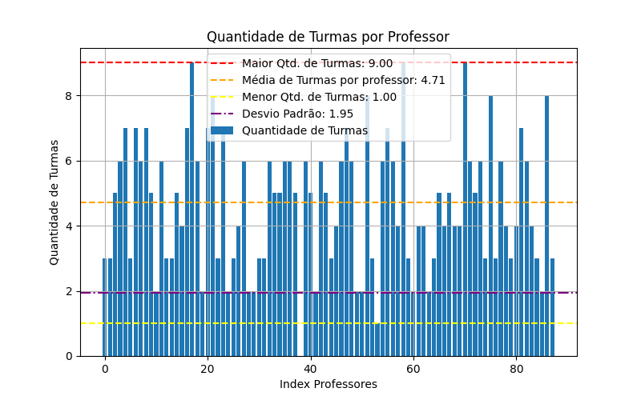
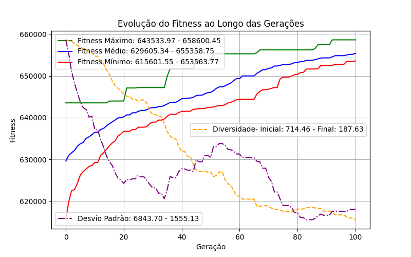
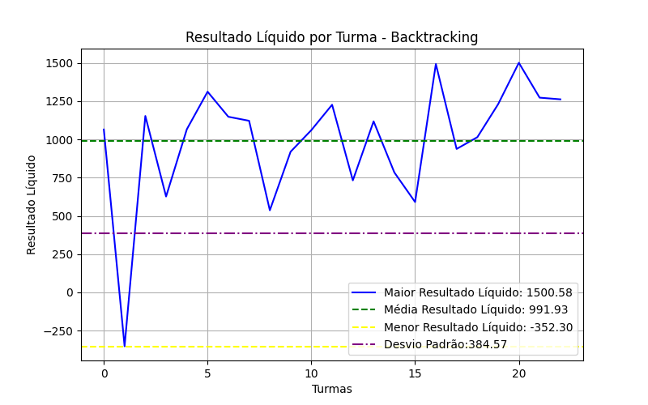

# Análise e Discussão dos Resultados

## Introdução
Neste documento, serão apresentados os resultados obtidos a partir da execução e análise de dois algoritmos: o Algoritmo Genético e o Backtracking. O objetivo é discutir os métricas de desempenho, comportamento e eficiência de cada abordagem em diferentes cenários de teste, classificados como MICRO, PEQUENO, MÉDIO e GRANDE.

---

## Algoritmo Genético

### Estrutura de Métricas
As métricas avaliadas para o Algoritmo Genético incluem:

- **Melhor Fitness em Cada Geração**: Análise da evolução do melhor fitness ao longo das gerações.
- **Melhor Fitness Final**: Valor do melhor fitness após a última geração.
- **Tempo de Execução**: Duração total do algoritmo.
- **Diversidade Durante as Gerações**: Métrica que avalia a variação populacional em termos de cromossomos.
- **Média e Mínimo do Fitness por Gerações**: Estatísticas de fitness em cada geração.
- **Desvio Padrão por Geração**: Análise da dispersão dos valores de fitness dentro de uma geração.

### Cenários de Teste
Foram definidos quatro cenários de teste:

1. **MICRO**
2. **PEQUENO**
3. **MÉDIO**
4. **GRANDE**

Para cada cenário, realizamos 4 testes independentes, coletando os resultados e gerando as imagens correspondentes.
#### Cenário Micro:
Abaixo apresentamos os gráficos com a evolução do fitness, fitness minimo e média, desvio padrão e diversidade em cada um dos testes.

##### Evolução Fitness pelas gerações
###### Micro Teste 1

###### Micro Teste 2

###### Micro Teste 3

###### Micro Teste 4

##### Analises do melhor e pior individuo ao final da ultima geração
##### Melhor Individuo
##### Micro Teste 1 - Quantidade de Turmas por professor

##### Micro Teste 2 - Quantidade de Turmas por professor

##### Micro Teste 3 - Quantidade de Turmas por professor

##### Micro Teste 4 - Quantidade de Turmas por professor

##### Micro Teste 1 - Carga Horaria por professor

##### Micro Teste 2 - Carga Horaria por professor

##### Micro Teste 3 - Carga Horaria por professor

##### Micro Teste 4 - Carga Horaria por professor

##### Micro Teste 1 - Resultado Liquido por Turma

##### Micro Teste 2 - Resultado Liquido por Turma

##### Micro Teste 3 - Resultado Liquido por Turma

##### Micro Teste 4 - Carga Horaria por professor

#### Cenário Pequeno:
Abaixo apresentamos os gráficos com a evolução do fitness, fitness minimo e média, desvio padrão e diversidade em cada um dos testes.

##### Evolução Fitness pelas gerações
###### Pequeno Teste 1

###### Pequeno Teste 2

###### Pequeno Teste 3

###### Pequeno Teste 4

##### Melhor Individuo
##### Pequeno Teste 1 - Quantidade de Turmas por professor

##### Pequeno Teste 2 - Quantidade de Turmas por professor

##### Pequeno Teste 3 - Quantidade de Turmas por professor

##### Pequeno Teste 4 - Quantidade de Turmas por professor

##### Pequeno Teste 1 - Carga Horaria por professor

##### Pequeno Teste 2 - Carga Horaria por professor

##### Pequeno Teste 3 - Carga Horaria por professor

##### Pequeno Teste 4 - Carga Horaria por professor

##### Pequeno Teste 1 - Resultado Liquido por Turma

##### Pequeno Teste 2 - Resultado Liquido por Turma

##### Pequeno Teste 3 - Resultado Liquido por Turma

##### Pequeno Teste 4 - Carga Horaria por professor

#### Cenário Médio:
Abaixo apresentamos os gráficos com a evolução do fitness, fitness minimo e média, desvio padrão e diversidade em cada um dos testes.

##### Evolução Fitness pelas gerações

###### Médio Teste 1

###### Médio Teste 2

###### Médio Teste 3

###### Médio Teste 4

##### Analises do melhor e pior individuo ao final da ultima geração
##### Melhor Individuo
##### Médio Teste 1 - Quantidade de Turmas por professor

##### Médio Teste 2 - Quantidade de Turmas por professor

##### Médio Teste 3 - Quantidade de Turmas por professor

##### Médio Teste 4 - Quantidade de Turmas por professor

##### Médio Teste 1 - Carga Horaria por professor

##### Médio Teste 2 - Carga Horaria por professor

##### Médio Teste 3 - Carga Horaria por professor

##### Médio Teste 4 - Carga Horaria por professor

##### Médio Teste 1 - Resultado Liquido por Turma

##### Médio Teste 2 - Resultado Liquido por Turma

##### Médio Teste 3 - Resultado Liquido por Turma

##### Médio Teste 4 - Carga Horaria por professor

#### Cenário Grande:
Abaixo apresentamos os gráficos com a evolução do fitness, fitness minimo e média, desvio padrão e diversidade em cada um dos testes.

##### Evolução Fitness pelas gerações

###### Grande Teste 1

###### Grande Teste 2

###### Grande Teste 3

###### Grande Teste 4

##### Analises do melhor e pior individuo ao final da ultima geração
##### Melhor Individuo
##### Grande Teste 1 - Quantidade de Turmas por professor

##### Grande Teste 2 - Quantidade de Turmas por professor

##### Grande Teste 3 - Quantidade de Turmas por professor

##### Grande Teste 4 - Quantidade de Turmas por professor

##### Grande Teste 1 - Carga Horaria por professor

##### Grande Teste 2 - Carga Horaria por professor

##### Grande Teste 3 - Carga Horaria por professor

##### Grande Teste 4 - Carga Horaria por professor

##### Grande Teste 1 - Resultado Liquido por Turma

##### Grande Teste 2 - Resultado Liquido por Turma

##### Grande Teste 3 - Resultado Liquido por Turma

##### Grande Teste 4 - Carga Horaria por professor

### Resultados e Discussão
Os principais resultados para cada cenário incluem:

#### Tempo, Desvio Padrão e Diversidade

#### Fitness minimo, médio e máximo

#### Melhor Individuo Gerado

## Backtracking

#### Cenário Grande:
Abaixo apresentamos os gráficos com a evolução do fitness, fitness minimo e média, desvio padrão e diversidade em cada um dos testes.

##### Analises do melhor e pior individuo ao final da ultima geração
##### Melhor Individuo
##### Micro Teste 1 - Quantidade de Turmas por professor 

##### Micro Teste 2 - Quantidade de Turmas por professor

##### Micro Teste 1 - Carga Horaria por professor

##### Micro Teste 2 - Carga Horaria por professor

##### Micro Teste 1 - Resultado Liquido por Turma

##### Micro Teste 2 - Resultado Liquido por Turma

##### Pequeno Teste 1 - Quantidade de Turmas por professor 

##### Pequeno Teste 2 - Quantidade de Turmas por professor

##### Pequeno Teste 1 - Carga Horaria por professor

##### Pequeno Teste 2 - Carga Horaria por professor

##### Pequeno Teste 1 - Resultado Liquido por Turma

##### Pequeno Teste 2 - Resultado Liquido por Turma

##### Médio Teste 1 - Quantidade de Turmas por professor 

##### Médio Teste 2 - Quantidade de Turmas por professor

##### Médio Teste 1 - Carga Horaria por professor

##### Médio Teste 2 - Carga Horaria por professor

##### Médio Teste 1 - Resultado Liquido por Turma

##### Médio Teste 2 - Resultado Liquido por Turma

##### Grande Teste 1 - Quantidade de Turmas por professor 

##### Grande Teste 2 - Quantidade de Turmas por professor

##### Grande Teste 1 - Carga Horaria por professor

##### Grande Teste 2 - Carga Horaria por professor

##### Grande Teste 1 - Resultado Liquido por Turma

##### Grande Teste 2 - Resultado Liquido por Turma

### Resultados e Discussão
Os principais resultados para cada cenário incluem:

#### Tempo de execução, fitness, estados visitados, podados e eficiência de poda

#### Receita médio, minima, maxima e desvio padrão das turmas

---

## Conclusões

- Comparativo entre o Algoritmo Genético e o Backtracking.

- Vantagens e desvantagens de cada abordagem em diferentes cenários.

- Implicações para a escolha de um algoritmo dependendo do problema e das restrições.

---

## Referências

- 
